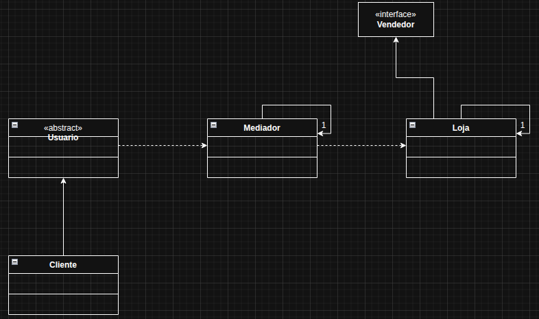

# Mediator

O Mediator é um padrão de projeto comportamental que centraliza a comunicação entre objetos, evitando que eles conversem diretamente entre si. Resumindo: em vez de cada objeto ficar falando com vários outros, todos se comunicam apenas com o mediador, que coordena as interações.

No exemplo usado, foi pensado em um plataforma de e-commerce, por exemplo: Amazon, onde ela faz a intermediação entre cliente e o vendedor de um produto, podendo o cliente fazer sugestão, elogio ou reclamação.

